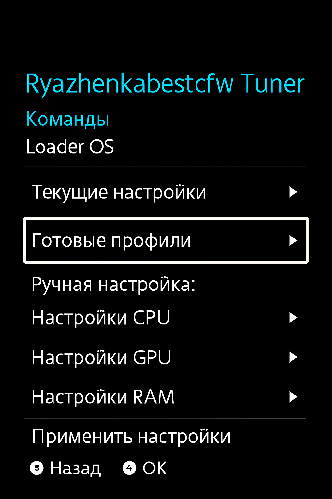
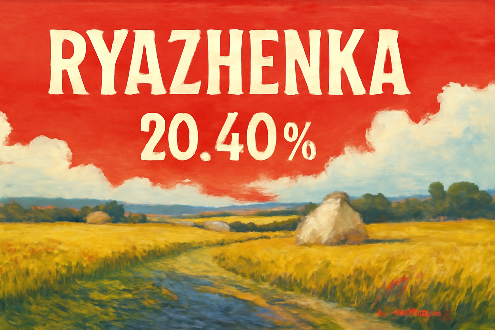
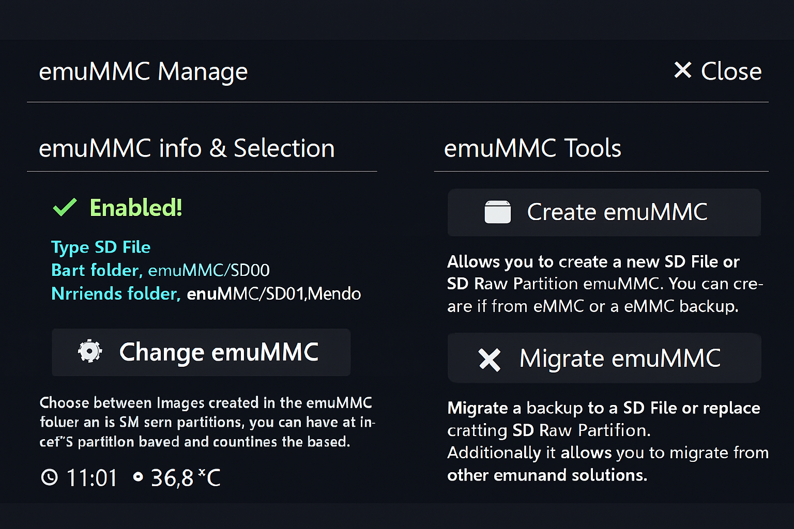
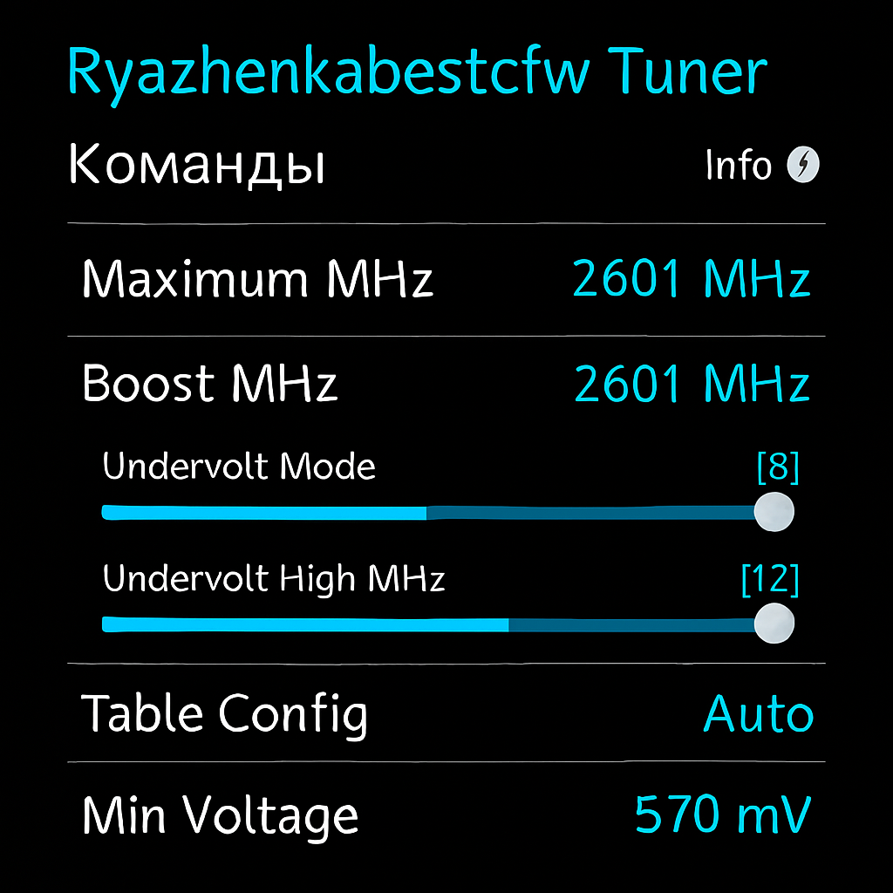
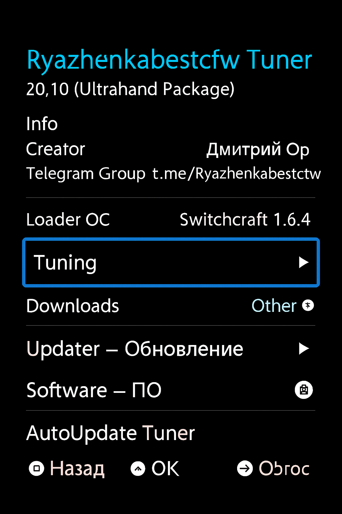
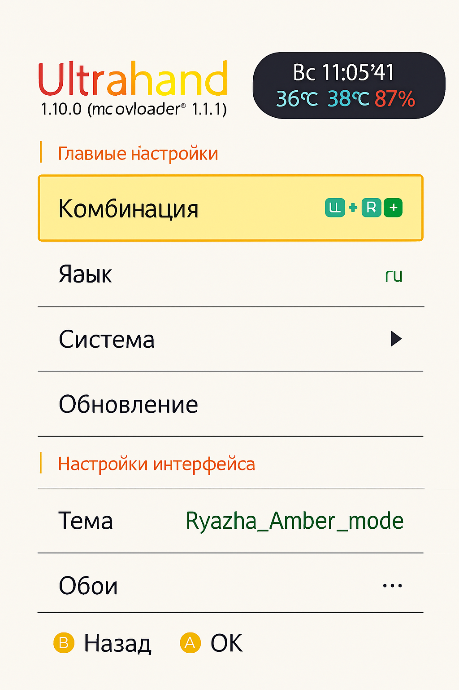
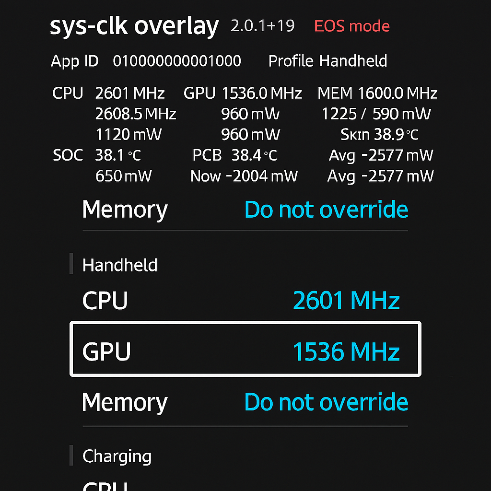
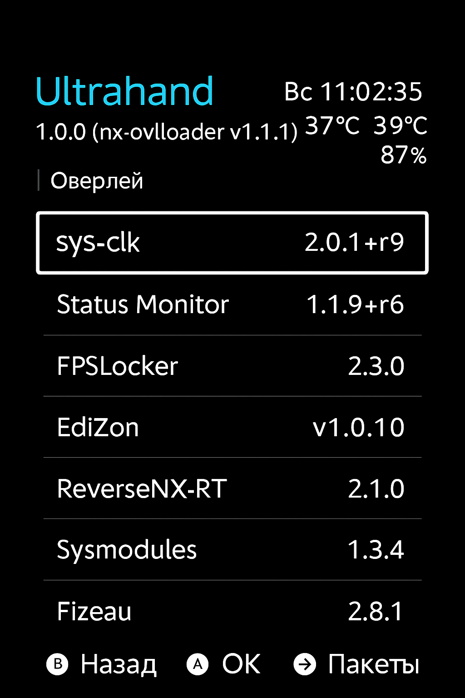

- sys-clk — управление частотами и power-profiles (пример: 2.0.1+r9)
- Status Monitor — мониторинг температур/заряда (пример: 1.1.9+r6)
- FPSLocker — блокировка/ограничение FPS (пример: 2.3.0)
- EdiZon — инструменты для работы с сохранениями и модами (пример: v1.0.10)
- ReverseNX-RT — runtime оптимизации (пример: 2.1.0)
- Fizeau — оптимизации и ускорение (пример: 2.8.1)
- Switchcraft (Loader OC) — вспомогательный загрузчик/инструмент (пример: v1.6.4)

Примечание: приведённые версии — примеры, обнаруженные в документации/скриншотах в репозитории. Окончательные версии и точный список модулей находятся в релизных архивах — проверяйте ZIP/manifest при скачивании.

---

## Галерея — скриншоты и ключевые артефакты

### Главное меню

Кратко: кастомный главный экран прошивки с быстрым доступом к настройкам и модулям.

---

### Splash / Логотип

Кратко: кастомный splash и логотип при запуске.

---

### EmuNAND — обзор

Кратко: управление EmuNAND и подсказки по созданию копии NAND.

---

### Tuner / CPU

Кратко: Tuner для управления частотами и профилями питания.

---

### Ultrahand — модули и темы

Кратко: меню модулей Ultrahand и доступные темы.

---

### Темы и оверлеи

Кратко: демонстрация темы и overlay sys-clk.

---

### Модули и каталоги

Кратко: пример списка модулей и их версий.

---

## Troubleshooting — частые проблемы и решения

- Прошивка не загружается: проверьте payload и корректность `hekate_ipl.ini`.
- Проблемы с EmuNAND: откатитесь на бэкап и повторите создание EmuNAND.
- Высокая температура при разгоне: снизьте профиль на Tuner и проверьте вентили/условия эксплуатации.
- Homebrew не виден: проверьте папку `switch` на SD и корректность прав/файлов.

Если не помогло — создайте Issue с подробным описанием и логами или напишите в Telegram (@Ryazhenkabestcfw).

---

## Релизы и подписи

Все официальные сборки публикуются в разделе Releases на GitHub: https://github.com/Dimasick-git/Ryzhenka/releases

Рекомендуется проверять контрольные суммы (SHA256) для загружаемых архивов — если подписи/контрольные суммы предоставлены в релизе, сверяйте их перед установкой.

---

## Вклад и разработка

Хотите помочь или предложить улучшение? Отлично.

1. Форкните репозиторий.
2. Создайте ветку feature/bugfix.
3. Внесите изменения и откройте Pull Request с описанием.

Обратите внимание: любые изменения, затрагивающие конфигурации загрузчика или ядра, должны иметь подробное обоснование и тесты на совместимость.

---

## Контакты и поддержка

- Telegram: https://t.me/Ryazhenkabestcfw (@Ryazhenkabestcfw) — основное место для обсуждений, вопросов и анонсов релизов.
- GitHub Releases: https://github.com/Dimasick-git/Ryzhenka/releases — скачивание сборок и архивов.
- Issues: используйте раздел Issues этого репозитория для баг-репортов и предложений.

---

## Лицензия

Проект распространяется в соответствии с файлом `LICENCE` в корне репозитория.

---

## Спасибо и кредиты

Большое спасибо всем, кто тестировал и помогал с интеграцией модулей и тем. Dimaick-git.