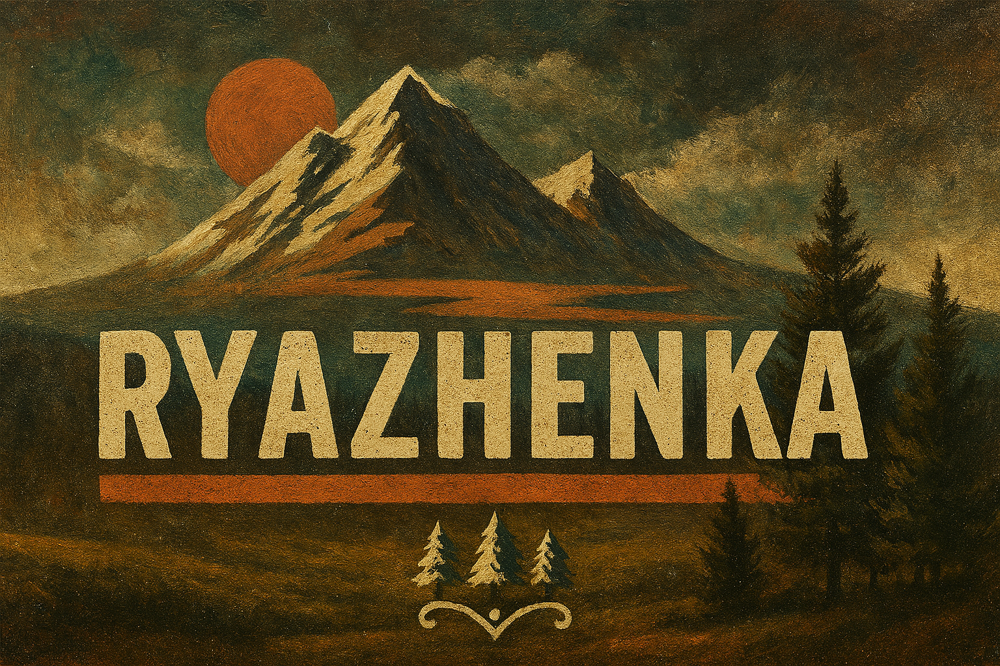

    

# Ryazhenka CFW

**Ryazhenka** is a custom firmware (CFW) package for Nintendo Switch, built on top of Atmosphere and Hekate. It bundles a curated set of homebrew tools, overlays, performance modules and quality-of-life tweaks — all developed and maintained by [Dimasick-git](https://github.com/Dimasick-git).

> Full documentation is in Russian below. | Полная документация на русском ниже.

---

**Содержание**
- [Назначение](#назначение)
- [Ключевые компоненты](#ключевые-компоненты)
- [Установка](#установка-микро-инструкция)
- [Статистика](#сводная-статистика)
- [Основные модули](#основные-модули)
- [Все репозитории](#все-репозитории-относящиеся-к-проекту)
- [Особая благодарность](#особая-благодарность)
- [Лицензия](#лицензия)

---

**Назначение**

Этот репозиторий содержит релизы и документацию для Ryazhenka CFW — комплексной сборки кастомной прошивки для Nintendo Switch. Объединяет проверенные компоненты (Atmosphere, Hekate) с собственными модулями производительности, системными оверлеями и утилитами настройки.

---

**Ключевые компоненты**

- `Ryazhahand-Overlay` — система управления оверлеями и пользовательскими настройками. Основан на базе Ultrahand. Переработано: Dimasick-git.
- `Ryazha-clk` — модуль управления частотами CPU/GPU/MEM/LCD, профилями производительности и VRR. Разработано: Dimasick-git.
- `Ryazhenka Tuner` — инструмент тонкой настройки прошивки и системных параметров. Основан на базе Ultra Tuner. Переработано: Dimasick-git.
- `RyazhaTune` — инструмент настройки системы нового поколения с расширенными возможностями. Разработано: Dimasick-git.
- `Ryazha-Status-Monitor` — оверлей мониторинга системных показателей в реальном времени (температура, частоты, RAM). Разработано: Dimasick-git.
- `ovlSysmodules` — оверлей управления системными модулями (sysmodules), включение/выключение без перезагрузки. Адаптировано: Dimasick-git.
- `FPSLocker` — патчер частоты кадров для игр Nintendo Switch. Адаптировано: Dimasick-git.
- `Fizeau` — управление цветовым профилем и гаммой дисплея. Адаптировано: Dimasick-git.
- `EdiZon` — редактор сохранений и чит-движок для Nintendo Switch. Адаптировано: Dimasick-git.

---

**Сводная статистика**

- Суммарные загрузки всех релизов: <!--TOTAL_DOWNLOADS-->**14918**<!--/TOTAL_DOWNLOADS-->
- Последний релиз Ryazhenka: [releases/latest](https://github.com/Dimasick-git/Ryzhenka/releases/latest)

---

**Основные модули**

| Модуль | Описание | Скачивания | Ссылка |
|---|---|---:|---|
| `Ryzhenka` | Основной пакет прошивки |  | [releases/latest](https://github.com/Dimasick-git/Ryzhenka/releases/latest) |
| `Ryazhahand-Overlay` | Оверлей управления системой и настройками |  | [Ryazhahand-Overlay](https://github.com/Dimasick-git/Ryazhahand-Overlay) |
| `Ryazha-clk` | Управление частотами CPU/GPU/MEM/LCD и VRR |  | [Sys-clk](https://github.com/Dimasick-git/Sys-clk) |
| `Ryazhenka Tuner` | Тонкая настройка прошивки и диагностика |  | [Ryazhenkabestcfw-Tuner](https://github.com/Dimasick-git/Ryazhenkabestcfw-Tuner) |
| `RyazhaTune` | Расширенный инструмент настройки системы |  | [RyazhaTune](https://github.com/Dimasick-git/RyazhaTune) |
| `Ryazha-Status-Monitor` | Мониторинг температуры, частот, RAM в реальном времени |  | [Ryazha-Status-Monitor](https://github.com/Dimasick-git/Ryazha-Status-Monitor) |
| `ovlSysmodules` | Управление sysmodules через оверлей |  | [ovlSysmodules](https://github.com/Dimasick-git/ovlSysmodules) |
| `FPSLocker` | Патчер частоты кадров для игр |  | [FPSLocker](https://github.com/Dimasick-git/FPSLocker) |
| `Fizeau` | Управление цветовым профилем дисплея |  | [Fizeau](https://github.com/Dimasick-git/Fizeau) |
| `EdiZon` | Редактор сохранений и чит-движок |  | [EdiZon](https://github.com/Dimasick-git/EdiZon) |

---

## Все репозитории относящиеся к проекту

| Репозиторий | Шильды |
|---|---|
| Ryzhenka |   |
| Ryazhahand-Overlay |   |
| Ryazha-clk |   |
| Ryazhenka-Tuner |   |
| RyazhaTune |   |
| Ryazha-Status-Monitor |   |
| EdiZon |   |
| ovlSysmodules |   |
| FPSLocker |   |
| Fizeau |   |

---

**Установка (микро-инструкция)**

1. Скачайте последний релиз: [releases/latest](https://github.com/Dimasick-git/Ryzhenka/releases/latest)
2. Скопируйте содержимое архива в корень SD-карты.
3. Запустите устройство в RCM → Hekate → Launch → Atmosphere.

Полная инструкция: [docs/INSTALL.md](docs/INSTALL.md)

---

## Особая благодарность

Спасибо всем, кто участвовал и участвует в этом проекте. Спасибо за помощь в написании кода, а также благодарность сообществу за отличные идеи!

---

**Лицензия**

Проект распространяется под лицензией MIT. Полная версия лицензии в файле [`LICENCE`](./LICENCE).
