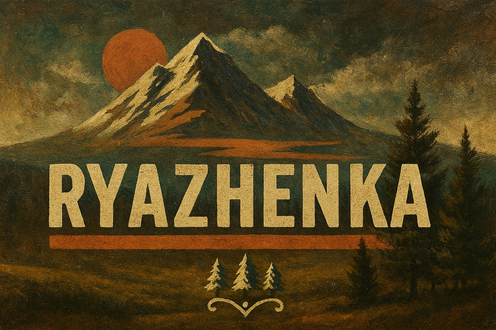

# Ryazhenka CFW

## English — short overview

Ryazhenka is a Nintendo Switch custom-firmware ecosystem built around Atmosphere and Hekate. It combines the main CFW distribution with overlays, performance tools, monitoring, utilities, and related Switch projects. Download the latest package from [Releases](https://github.com/Dimasick-git/Ryzhenka/releases/latest), read the [installation guide](docs/INSTALL.md), or open the [project website](https://dimasick-git.github.io/Ryzhenka/).

> The aggregate counter below is updated automatically from release assets across all repositories listed in [`scripts/repos.txt`](scripts/repos.txt).

---

# Ryazhenka — подробная информация

## Что это за проект

**Ryazhenka** — это экосистема кастомной прошивки Nintendo Switch на базе **Atmosphere** и **Hekate**. Основной репозиторий содержит сборку Ryazhenka и ссылки на связанные проекты: оверлеи, мониторинг, управление частотами, системные утилиты и дополнительные инструменты.

Содержимое сборки, совместимость компонентов и порядок обновления зависят от конкретного релиза. Поэтому перед установкой или обновлением нужно открыть release notes и использовать файлы только из официальных страниц проекта.

## Быстрые ссылки

| Раздел | Ссылка |
|---|---|
| Последний релиз | [Скачать Ryazhenka](https://github.com/Dimasick-git/Ryzhenka/releases/latest) |
| Все релизы | [Открыть releases](https://github.com/Dimasick-git/Ryzhenka/releases) |
| Сайт проекта | [dimasick-git.github.io/Ryzhenka](https://dimasick-git.github.io/Ryzhenka/) |
| Установка | [docs/INSTALL.md](docs/INSTALL.md) |
| Частые вопросы | [docs/FAQ.md](docs/FAQ.md) |
| Разработка и CI | [docs/DEVELOPMENT.md](docs/DEVELOPMENT.md) |
| Участие в проекте | [docs/CONTRIBUTING.md](docs/CONTRIBUTING.md) |
| Сообщество | [Telegram](https://t.me/Ryazhenkacfw) |

## Статистика экосистемы

| Показатель | Значение |
|---|---:|
| **Скачивания всех отслеживаемых release assets** | **<!--TOTAL_DOWNLOADS-->**18229**<!--/TOTAL_DOWNLOADS-->** |
| Репозитории в автоматическом подсчёте | **18** |
| Основной репозиторий | [Dimasick-git/Ryzhenka](https://github.com/Dimasick-git/Ryzhenka) |
| Последний основной релиз | [Открыть последний релиз](https://github.com/Dimasick-git/Ryzhenka/releases/latest) |

### Как считается количество скачиваний

Скрипт [`scripts/update_downloads.py`](scripts/update_downloads.py) получает список из [`scripts/repos.txt`](scripts/repos.txt), проходит по всем доступным страницам релизов каждого репозитория и суммирует `download_count` всех release assets. Workflow запускается по расписанию, вручную и после публикации нового релиза. Поэтому число выше относится ко всей отслеживаемой экосистеме, а не только к архивам главного репозитория.

## Установка

Перед началом сделайте резервную копию важных данных консоли и внимательно проверьте модель Nintendo Switch. Кастомная прошивка и модификация системных файлов выполняются на ваш риск.

1. Откройте [последний релиз Ryazhenka](https://github.com/Dimasick-git/Ryzhenka/releases/latest) и прочитайте его описание.
2. Скачайте нужный архив и распакуйте его содержимое в корень SD-карты, отформатированной в FAT32.
3. Для непатченной V1 используйте RCM и Hekate.
4. Для patched V1, V2, Lite и OLED необходим совместимый модчип.
5. Запустите конфигурацию Atmosphere из релиза через Hekate.
6. После запуска проверьте совместимость Atmosphere, HOS и установленных модулей.

Полная пошаговая инструкция находится в [docs/INSTALL.md](docs/INSTALL.md). Таблица совместимости и ответы на типовые вопросы находятся в [docs/FAQ.md](docs/FAQ.md).

## Состав экосистемы

| Проект | Назначение | Репозиторий |
|---|---|---|
| **Ryazhenka** | Основная сборка CFW и официальные релизы | [Ryzhenka](https://github.com/Dimasick-git/Ryzhenka) |
| **Ryazhahand-Overlay** | Оверлей Tesla, управление пакетами и настройками | [Ryazhahand-Overlay](https://github.com/Dimasick-git/Ryazhahand-Overlay) |
| **Ryazha Status Monitor** | FPS, частоты, температура, заряд и телеметрия | [Ryazha-Status-Monitor](https://github.com/Dimasick-git/Ryazha-Status-Monitor) |
| **Ryazha-clk** | Профили CPU, GPU, памяти, дисплея и VRR | [Sys-clk](https://github.com/Dimasick-git/Sys-clk) |
| **RyazhaAI** | Ассистент по CFW, homebrew и диагностике | [RyazhaAI](https://github.com/Dimasick-git/RyazhaAI) |
| **Atmosphere-RYZ** | Связанный с Ryazhenka вариант Atmosphere | [Atmosphere-RYZ](https://github.com/Dimasick-git/Atmosphere-RYZ) |
| **RyazhaTune** | Музыкальный и вспомогательный проект | [RyazhaTune](https://github.com/Dimasick-git/RyazhaTune) |
| **AIO-Switch-Updater** | Обновление компонентов прямо на консоли | [AIO-Switch-Updater](https://github.com/Dimasick-git/AIO-Switch-Updater) |
| **Mission Control** | Поддержка Bluetooth-контроллеров | [Mission-Control](https://github.com/Dimasick-git/Mission-Control) |
| **Fizeau** | Управление цветом и гаммой дисплея | [Fizeau](https://github.com/Dimasick-git/Fizeau) |
| **FPSLocker** | Управление частотой кадров в совместимых играх | [FPSLocker](https://github.com/Dimasick-git/FPSLocker) |
| **ReverseNX-RT** | Переключение docked/handheld-режимов | [ReverseNX-RT](https://github.com/Dimasick-git/ReverseNX-RT) |
| **SwitchWave** | Медиа- и аудиопроект для Switch | [SwitchWave](https://github.com/Dimasick-git/SwitchWave) |
| **EdiZon** | Инструменты сохранений и читов | [EdiZon](https://github.com/Dimasick-git/EdiZon) |
| **ovlSysmodules** | Управление системными модулями через оверлей | [ovlSysmodules](https://github.com/Dimasick-git/ovlSysmodules) |
| **PPSSPP** | Сборка PSP-эмулятора для HOS 21 | [PPSSPP](https://github.com/Dimasick-git/PPSSPP) |
| **Minecraft Online for Switch** | Связанный с Minecraft проект для Switch | [Minecraft-Online-for-switch](https://github.com/Dimasick-git/Minecraft-Online-for-switch) |

Полный технический список репозиториев, используемый счётчиком загрузок, находится в [`scripts/repos.txt`](scripts/repos.txt).

## Документация

| Документ | Описание |
|---|---|
| [INSTALL.md](docs/INSTALL.md) | Установка, подготовка SD-карты и запуск |
| [FAQ.md](docs/FAQ.md) | Совместимость, безопасность и частые вопросы |
| [DEVELOPMENT.md](docs/DEVELOPMENT.md) | Локальная разработка, сборка и автоматизации |
| [CONTRIBUTING.md](docs/CONTRIBUTING.md) | Правила предложений, issues и pull requests |
| [README-DEPLOY.md](README-DEPLOY.md) | Диагностика и описание деплоя GitHub Pages |

## Обновления и помощь

Новости, новые сборки и файлы публикуются через [GitHub Releases](https://github.com/Dimasick-git/Ryzhenka/releases). Если вы нашли ошибку, создайте [Issue](https://github.com/Dimasick-git/Ryzhenka/issues) с описанием модели консоли, версии релиза и шагов воспроизведения. Для быстрых вопросов доступен [Telegram](https://t.me/Ryazhenkacfw).

## Лицензия

Проект распространяется по лицензии [MIT](LICENCE). Перед использованием сторонних компонентов проверьте их собственные лицензии и условия распространения.
