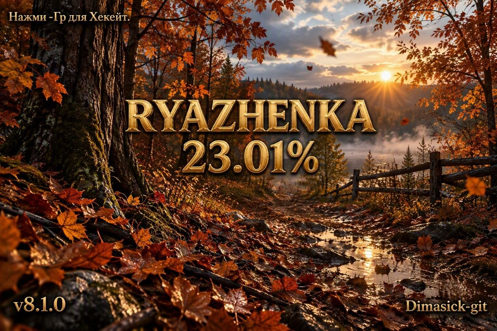

# Ряженка v8.1.0

> **Поддерживаемая версия Horizon OS — 23.0.1.**

Ряженка v8.1.0 использует базу **Atmosphère 1.12.0** и загрузчик **Hekate / Nyx**. В пакет включены обновлённые компоненты и исправления совместимости для загрузки системы и запуска игр на HOS 23.0.1.

## Исправлено в текущем ZIP

| Исправление | Результат |
| --- | --- |
| Поддержка HOS 23.0.1 | Обновлена база Atmosphère и компоненты сборки. |
| Старые homebrew | Сохранены исправления ABI для приложений на старых версиях libnx, включая PPSSPP. |
| Запуск игр с ZBIC | Поддержка нового сжатия включена в loader Atmosphère. |
| Hekate и Lockpick | Обновлён Lockpick до **2.0.1**. Автоснятие без нажатий и возврат в Hekate сохранены; старые ключи обновляются однократно, защита от циклических перезагрузок сохранена. |
| MissionControl | Обновлён до **v0.16.1**, исправлена подмена оригинальных цветов Joy-Con. |
| Оверлеи | Обновлены Fizeau, ovlSysmodules, EdiZon, ReverseNX-RT и FPSLocker. |
| Tuner 11.1.0 | Добавлена отдельная вкладка модов Zelda с настройками на русском и сохранением TotK. |
| Патчи памяти | Обновлены варианты +1,85 МБ и +40 МБ для Atmosphère 1.12, сохранена совместимость старых homebrew. |
| Загрузка ресурсов | Моды Zelda и сохранение доступны через зеркало Ряженки с автоматической синхронизацией. |

MissionControl Ряженки: [релиз v0.16.1](https://github.com/Dimasick-git/Mission-Control/releases/tag/v0.16.1).

Микро-режим Status Monitor в доке пока может не отображаться. Патч памяти +40 МБ отключает веб-браузер и может влиять на использующие его игры.

## Файлы релиза

| Файл | Назначение |
| --- | --- |
| `Ryazhenkabestcfw.zip` | Полная Ряженка v8.1.0 с обновлёнными компонентами для HOS 23.0.1. |
| `Ryazhenka-8.1.0.jpg` | Изображение для оформления релиза. |

## Установка

1. Создайте резервную копию данных SD-карты и сохранений.
2. Для чистой установки удалите старые файлы Ряженки, Atmosphère, Hekate и ранее установленных модулей.
3. Сохраните пользовательские папки `Nintendo` и `emuMMC` / emuNAND.
4. Распакуйте `Ryazhenkabestcfw.zip` в корень SD-карты с объединением папок.
5. Вставьте SD-карту в консоль и загрузите Ряженку штатным способом.

> **Важно:** не устанавливайте этот основной ZIP через AIO и не накладывайте его поверх старой сборки без предварительной очистки устаревших компонентов.

## Поддержка

Об ошибках и вопросах сообщайте через [Issues](https://github.com/Dimasick-git/Ryzhenka/issues) репозитория Ряженки.

**Автор и сопровождение: Dimasick-git.**

## Проверка архива

В текущем архиве заменены Hekate / Nyx и Lockpick на комплект с автоснятием,
проверенный автором на консоли. Остальные файлы сохранены без изменений.
Проверены целостность ZIP, контрольные суммы и одинаковые payload для ручного
и автоматического запуска Lockpick.

SHA-256 `Ryazhenkabestcfw.zip`:
`26e1fe9d2656d69ed683582a6a22d4e9b8ea4a81eff02b741d292c5c9edcae0a`
